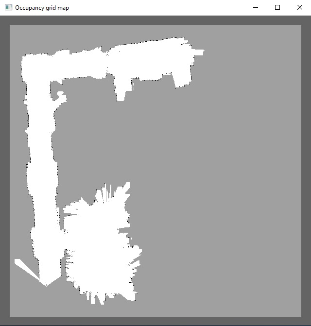
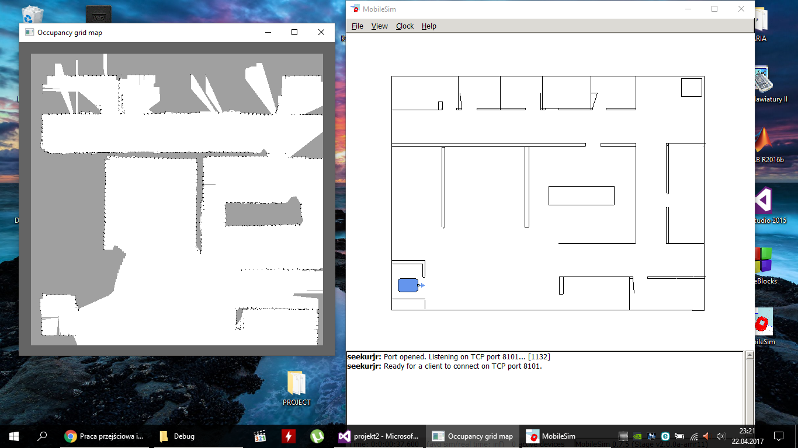

# Seekur_mapping

Project was developed as intro to Bachelor Thesis at Faculty of Power and Aeronautical Engineering.

Aim of the project: mapping the mobile robot's environment.
Algorithm of mapping bases on *Naive Bayes classifier*.

Program was tested on simulator (*MobileSim*) and real robot (*Seekur Jr*).

### Content:

* `display` - MVS project aimed to display occupancy grid map
* `mapping` - MVS project: mapping algorithm, robot's controller: that project was developed using *ARIA* library (Advanced Robotics Interface for Applications: [link_to_github](https://github.com/cinvesrob/Aria))
* `maps` - example maps
* `raport.pdf` - more accurate description (in polish)

### Example maps

* real robot

* simulator

